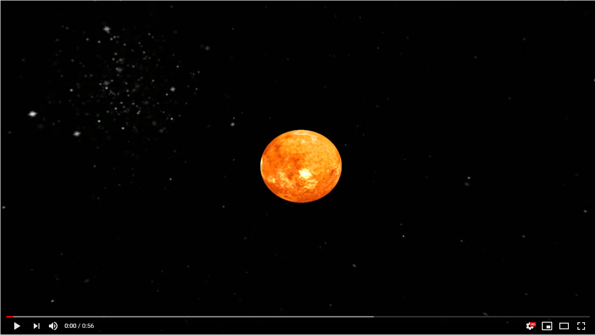

# SOLAR SYSTEM
SolarSystem is rather simplistic visualization of our Solar System.
Planet's position calculation are based on this [publication](https://stjarnhimlen.se/comp/ppcomp.html).
All objects are in relative size and distance to each other, but to manage huge scale of Solar System all distances between planets has been reduced three times.
By default each second of program corresponds to one day of simulation.
This can be changed to respectively to 2, 4, 10 or 50 days per second.

Programmed with C++17 and modern OpenGL (Core-profile).

### CONTROLS 
* WSAD to move
* MOUSE to rotate
* LEFT SHIFT to move camera faster
* 0 - 8 to focus camera on object
* SCROLL to change camera's distance from observed object
* ARROWS to control time flow
* SPACE to puase/unpasue time
* TAB to change rendering mode

### Showcase

### DEPENDENCIES
* GLFW
* GLAD
* GLM
* Assimp
* STB

### SPECIAL THANKS
* 3D planet model: https://free3d.com/user/printable_models
* Planet textures: https://www.solarsystemscope.com/textures/
* Skybox texture: http://www.custommapmakers.org/skyboxes.php
